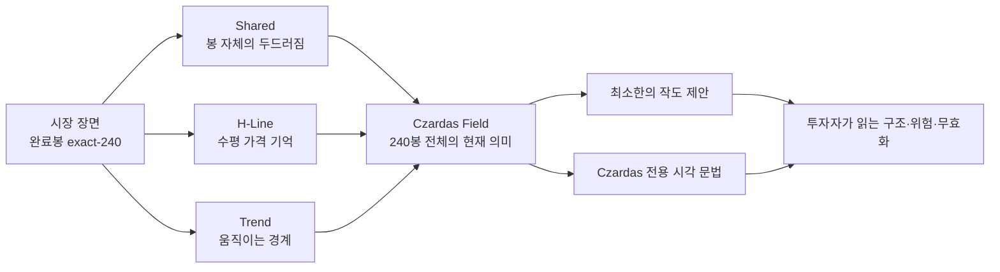
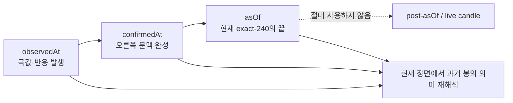
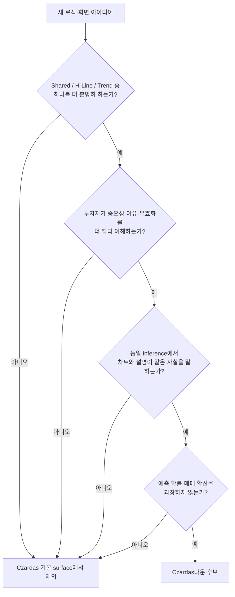
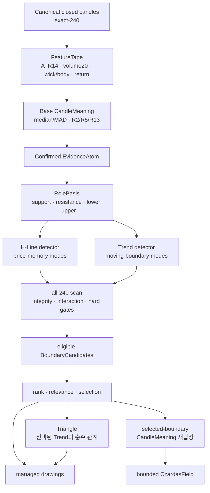
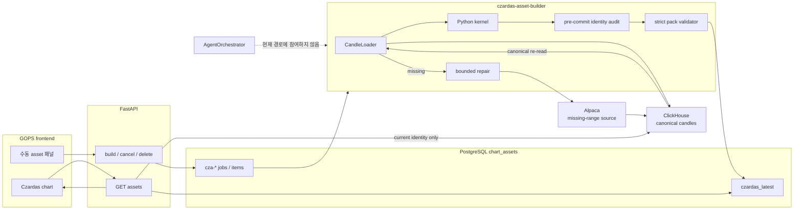
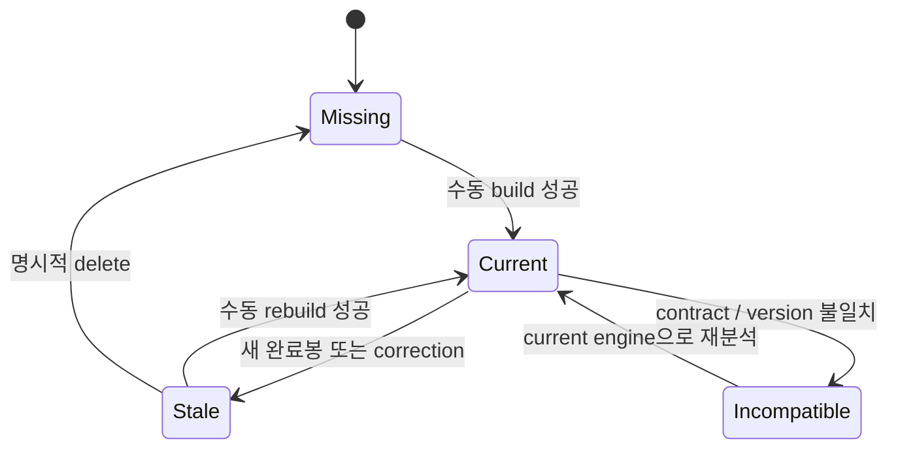
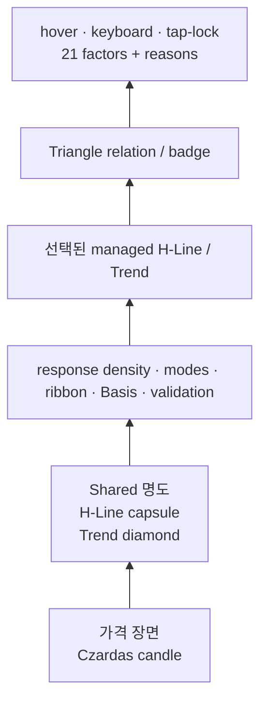
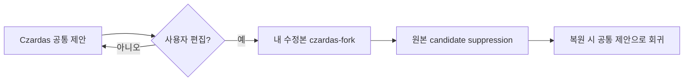
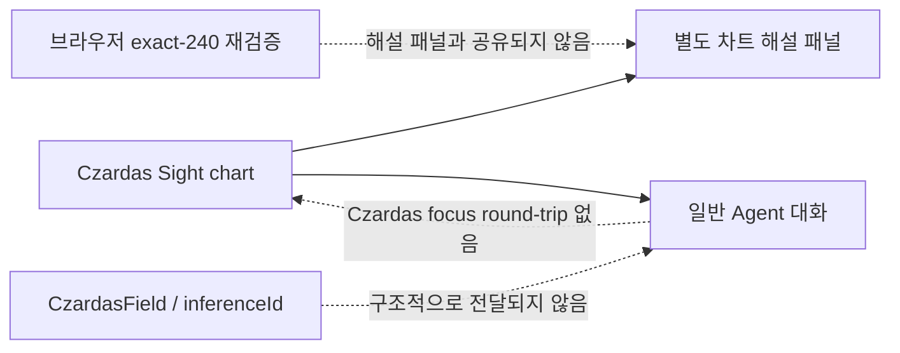
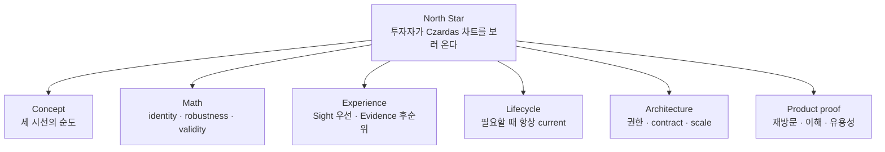

# Czardas 분석 보고서

> 시니어 개발자이자 전문 투자자의 관점에서 본 Czardas v2의 컨셉, 통계·기하 로직, 아키텍처, 차트 경험과 발전 가능성

- 분석 기준일: 2026-07-14
- 분석 기준: 현재 working tree의 코드, 테스트, `docs/` 기준 문서
- 핵심 참고 문서: [Czardas README](../docs/czardas/README.md), [Engine Specification](../docs/czardas/ENGINE_SPEC.md), [Agent Architecture](../docs/AGENT_ARCHITECTURE.md), [Frontend Integration](../docs/AGENT_FRONTEND_INTEGRATION.md)
- 주의: 이 문서는 시스템과 투자적 해석 도구에 대한 분석이며, 특정 종목의 매매 권고가 아니다.

---

## 1. 총평

결론부터 말하면, **Czardas는 이미 독창적인 차트 엔진의 뼈대를 갖췄다.** 그 독창성은 자동으로 수평선과 추세선을 그린다는 데 있지 않다. 최신 240개 완료봉을 하나의 현재 장면으로 보고, 모든 봉을 `Shared`, `H-Line`, `Trend`라는 세 채널로 다시 해석한 뒤, 그 해석 자체를 차트의 명도·형태·영역·선으로 표현한다는 데 있다.

이것은 흔한 지표 조합기나 패턴 탐색기와 분명히 다르다. Czardas의 가장 큰 자산은 H-Line이나 Trend 한두 개가 아니라 **`CzardasField`라는 통합된 시각적 관점**이다.

다만 현재 상태는 “투자자가 Czardas 차트를 보기 위해 GOPS를 찾는 제품”보다는 **수학적 계약과 추론 근거를 엄격히 구현한 전문가용 엔진 및 개발 도구**에 가깝다. 플래그십 제품으로 가는 데 가장 큰 장애물은 새 분석 로직의 부족이 아니다.

1. 새 봉이 생길 때마다 자산이 stale되는데 빌드는 수동이다.
2. 기본 화면에 Czardas의 시선과 내부 추론 디버거가 함께 노출되어 시각적으로 과밀하다.
3. 결정론·계약 테스트는 강하지만 투자적 유용성, 안정성, 사용자 이해도 평가는 거의 없다.
4. 동일한 `inferenceId`에서 다른 결과가 생길 수 있는 입력 digest 결함이 재현된다.
5. 차트, Czardas 해설, 일반 Agent 대화가 같은 inference를 공유하는 하나의 제품 여정으로 묶이지 않았다.

따라서 앞으로의 방향은 **더 많이 탐지하는 Czardas**가 아니라 **더 명료하게 보고, 항상 최신으로 보여 주며, 그 시선의 유용성을 검증하는 Czardas**여야 한다.

### 정성 평가

| 관점 | 평가 | 소견 |
| --- | --- | --- |
| 컨셉 독창성 | 매우 강함 | Price Memory, Moving Boundary, 전봉 Field라는 고유한 문법이 있다. |
| 통계·기하 일관성 | 강함 | fit·refinement의 robust aggregation과 기하 fitting이 하나의 현재 장면 해석에 수렴한다. |
| 실행 재현성·감사 가능성 | 강함, identity 보완 필요 | accepted row bytes의 결정론, provenance closure, strict validator, stale 차단은 강하지만 input hash equivalence에는 재현된 결함이 있다. |
| 투자적 유용성 검증 | 부족 | 구조적 타당성은 있으나 정보가치·안정성·walk-forward 결과가 없다. |
| 제품 가용성 | 약함 | 수동 build와 다음 canonical 완료봉부터 stale되는 lifecycle이 비전과 직접 충돌한다. |
| 기본 화면 가독성 | 보통 이하 | 독자적 문법은 있으나 기본 Field가 내부 근거까지 모두 그려 과밀하다. |
| 운영·보안 완성도 | 보완 필요 | 권한, owner, rate limit, submit/cancel 경계에 중요한 빈틈이 있다. |

---

## 2. Czardas의 컨셉

### 2.1 한 문장 정의

**Czardas는 최신 완료봉 240개를 하나의 현재 장면으로 보고, 봉의 형태적 두드러짐, 수평 가격 기억, 움직이는 경계를 통계와 기하로 해석하여 차트 전체를 다시 보이게 하는 결정론적 시선이다.**



이 정의에서 순서가 중요하다. 작도는 Field의 부산물이지 Czardas의 전부가 아니다. 자동선만 남기고 전봉 의미와 시각 문법을 잃으면, 기능은 남아도 Czardas의 정체성은 사라진다.

### 2.2 Present Snapshot: 과거 재생이 아니라 현재의 재해석

Czardas는 각 과거 시점에 무엇을 판단했는지를 복원하지 않는다. `asOf`에서 끝나는 완료봉 240개 전체를 보고, **지금 이 장면에서 과거의 각 봉이 어떤 의미를 갖는지** 다시 계산한다.



이 계약은 두 가지를 동시에 의미한다.

- 현재 장면을 해석하는 도구로서는 look-ahead가 아니다. `asOf` 이후 데이터와 live candle은 배제된다.
- 그러나 과거 봉의 색과 의미를 당시 알 수 있었던 신호처럼 읽으면 hindsight다. 과거 봉은 이후의 in-snapshot 문맥과 최종 선택 경계를 사용해 다시 칠해진다.

이 구분은 Czardas의 정직성에 매우 중요하다. 차트에는 계속해서 `현재 240봉 기준`이라는 문맥이 보여야 하며, 연구 평가는 각 과거 `asOf`에서 exact-240을 새로 만드는 walk-forward 방식으로만 해야 한다.

### 2.3 세 개의 시선

| 시선 | 핵심 질문 | 통계·기하적 의미 | 화면 표현 |
| --- | --- | --- | --- |
| Shared | 이 봉은 현재 240봉 안에서 얼마나 두드러지는가? | ATR 대비 범위·이동, 몸통·꼬리, R2/R5/R13 주변 위치 | candle 명도 |
| H-Line | 이 가격대는 반복적으로 기억되고 있는가? | rejection 기반 corridor, 가격축 interval sweep, 시간상 분리된 episode, robust center/zone | 둥근 capsule, corridor, 수평선 |
| Trend | 저점 또는 고점의 움직이는 경계가 존재하는가? | stratified anchors, pair hypotheses, L∞ grouping, robust slope/intercept | 각진 diamond, ribbon, 추세선 |

`Composite percentile`은 세 채널이 합쳐진 240봉 내부 상대 순위다. 이는 상승 확률, 매수 강도, 기대수익률 또는 calibrated confidence가 아니다.

### 2.4 Czardas다움의 기준

앞으로 추가되는 기능은 다음 질문을 통과해야 한다.



일반 지표, 패턴 이름, 예외 branch 또는 LLM 설명을 더하는 것만으로는 이 기준을 통과할 수 없다.

---

## 3. 핵심 로직 분석

### 3.1 전체 계산 흐름



Python kernel이 factor, geometry, rank의 단일 source of truth다. 프런트는 pack을 검증하고 역변환해 그릴 뿐 수학을 다시 계산하지 않는다. 이 경계는 매우 적절하다.

### 3.2 입력과 기초 통계

입력은 다음 계약을 전제로 한다.

- 동일 symbol과 interval의 완료봉 정확히 240개
- split-adjusted, regular-session, canonical v2
- 오름차순 candle identity와 유효한 OHLCV
- live candle과 `asOf` 이후 데이터 제외

기초 feature는 Wilder ATR14, 직전 20봉 거래량 rank 및 log-volume z-score, body/wick, close return이다. 가격 관련 거리는 ATR로 정규화되며, 최신성은 120봉 half-life를 사용한다.

각 factor는 정규화 단계에서 available 값들의 median과 MAD로 robust-normalize된다.

```text
center = median(values)
scale  = max(1.4826 × MAD, floor)
normalized = clamp01(0.5 + (value-center)/(6×scale))
```

이 정규화 방식은 평균·표준편차보다 outlier에 강하다. 다만 seed가 되는 strict extrema와 wick, snapshot min/max 기반 profile까지 전체 detector가 robust하다는 뜻은 아니다. 또한 MAD가 0인 퇴화 분포에서 현재 floor가 `1e-12`이므로, 실질적으로 무의미한 미세 차이가 개별 factor를 0 또는 1로 포화시키고 최종 meaning을 왜곡할 수 있다. 이 문제는 뒤의 약점에서 다시 다룬다.

### 3.3 Evidence와 RoleBasis

R2, R5, R13 centered window에서 swing high/low를 찾는다. 오른쪽 문맥이 아직 부족하면 `confirmation_pending`으로 남기고 실제 geometry seed로 승격하지 않는다. 같은 가격의 연속 plateau를 하나로 접고, 같은 kind만 NMS cluster로 묶는다.

그 결과는 네 역할로 나뉜다.

| Evidence | RoleBasis | 의미 |
| --- | --- | --- |
| rejection low | support | 가격이 아래에서 거부된 수평 기억 |
| rejection high | resistance | 가격이 위에서 거부된 수평 기억 |
| swing low | lower | 이동하는 하단 구조의 endpoint |
| swing high | upper | 이동하는 상단 구조의 endpoint |

pre-Field 역할값은 단순 시각 장식이 아니다. RoleBasis 질량의 20%로 실제 seed 추론에 들어간다. 다만 거래량은 H-Line에서 구조 질량을 `0.90..1.00` 범위로만 조정하며, Trend geometry는 거래량과 독립이다. “거래량이 많으니 선을 만든다”가 아니라 “이미 존재하는 가격 기억의 참여도를 제한적으로 보강한다”는 설계가 정직하다.

### 3.4 H-Line: Price Memory

H-Line의 핵심 은유는 **가격 기억**이다. 이는 참여자의 실제 원가나 주문장 기억을 관측한 사실이 아니라, OHLCV rejection이 겹친 가격대를 Czardas가 그렇게 해석하는 모델 은유다.

1. support/resistance Basis의 wick corridor에 ATR tolerance를 붙인다.
2. 가격축에서 exact interval sweep을 수행한다.
3. 여러 corridor가 겹치는 response mass의 ridge를 찾는다.
4. 같은 시장 시험에 속한 Basis를 FormationEpisode 하나로 압축한다.
5. zone을 이탈했다가 돌아오는 규칙으로 시간상 분리된 episode 두 개 이상을 robust weighted median/MAD로 center와 zone에 맞춘다.
6. 모든 240봉을 검사하고, 경계 근처 또는 침투가 있는 fact를 bounded loss에 적분해 wick, body, close penetration과 현재 open break를 평가한다.
7. 동일 OHLCV로 만든 48-bin 추정 volume profile은 hard gate를 통과한 후보의 rank에만 최대 0.05를 더한다.

장점은 선이 단순한 pivot 연결이 아니라 **반복된 가격 시험의 겹침과 시간적 분리**에서 나온다는 점이다. 이 episode들은 운영상 분리된 군집이지 통계적으로 독립인 표본은 아니다. 단점은 response ridge, episode, profile, integrity가 모두 결합되면서 핵심 은유에 비해 구현 파라미터가 크게 늘었다는 점이다.

### 3.5 Trend: Moving Boundary

Trend의 핵심 은유는 **움직이는 경계**다.

1. 240봉을 80봉씩 세 구간으로 나누고 lower/upper anchor를 구간별 최대 4개 선택한다.
2. 최소 12봉 떨어진 anchor pair로 방향별 최대 66개 hypothesis를 만든다.
3. seed mass가 큰 hypothesis부터, median ATR로 scale한 L∞ threshold를 사용해 leader grouping한다.
4. 그룹 안에서 weighted medoid를 고르고 compatible Basis를 episode로 압축한다.
5. episode pair slope의 weighted median으로 기울기를 정한다.
6. lower는 q20, upper는 q80 residual을 seed로 삼고 Huber loss와 integrity로 intercept를 고른다.
7. body/close integrity와 최신 두 종가의 open break를 hard gate로 사용한다.

세 구간 stratification은 최근의 강한 pivot만 남는 것을 막고 전체 장면의 구조를 보존한다. lower와 upper를 독립적으로 찾기 때문에 평행·수렴·발산을 모두 허용하며, Triangle을 만들기 위해 선을 억지로 비틀지 않는다.

### 3.6 Formation, response, rank와 selection

Formation과 response를 시간적으로 분리한 것은 좋은 설계다. `fitEvidenceConfirmedAt` 이후부터 interaction을 시작하므로 같은 evidence를 fitting과 반응으로 중복 계산하지 않는다. 다만 이 response는 같은 exact-240 안의 post-fit 관측이며 out-of-sample future가 아니다. 진짜 미래 interaction은 각 historical `asOf`에서 geometry를 동결한 walk-forward에서만 평가할 수 있다.

```text
baseRank = 0.50 × seedQuality
         + 0.30 × integrity
         + 0.20 × persistence

response bonus <= 0.10
H-Line profile bonus <= 0.05
```

이 rank는 **구조 후보를 정렬하는 heuristic**이다. 확률이나 신뢰구간이 아니다. 최근 실제 corpus에서 선택된 rank가 대체로 0.71~0.94에 몰린 점을 고려하면, 수치 자체의 절대적 의미보다 후보 간 상대 순위로만 해석하는 편이 안전하다.

선택은 rank 0.45 이상이면서 최근 fact가 있거나 현재가와 3 ATR 이내인 후보를 대상으로 한다. 명세는 목표 개수를 quota가 아니라고 설명하지만, eligible 후보의 utility가 항상 크게 양수이고 중복 penalty가 상대적으로 작아 후보가 충분하면 기본 2개를 사실상 채우는 경향이 있다. NVDA는 support H-Line 두 개, TSLA는 resistance H-Line 두 개가 선택됐다. 이는 정직한 one-sided 구조일 수 있지만, “두 개를 보여 주기 위한 두 개”가 되지 않도록 abstention 기준을 더 검토할 필요가 있다.

### 3.7 Triangle의 위치

Triangle은 선택된 lower/upper Trend의 수렴, containment, apex 관계를 분류하는 순수 파생물이다. 별도 detector가 아니고 geometry나 rank를 바꾸지 않는다는 점은 좋다.

다만 `상승 삼각형`, `하락 삼각형` 같은 전통적 이름은 사용자에게 방향 예측을 연상시킨다. Czardas 안에서는 어디까지나 **두 이동 경계의 기하 관계**여야 한다. Triangle을 패턴 확장 출발점으로 삼는 순간 Czardas는 쉽게 일반적인 pattern zoo로 변한다.

---

## 4. 아키텍처 분석

### 4.1 현재 런타임 흐름

Czardas는 일반 `AgentOrchestrator`의 query understanding, provider snapshot, role agent, synthesis, Redis report 경로와 분리되어 있다.



Redis, Kafka, S3, OpenAI는 Czardas asset 경로에 참여하지 않는다. PostgreSQL이 queue, progress, latest pack을 모두 소유하고, ClickHouse가 canonical candle의 source of truth다.

### 4.2 소유권과 경계

| 경계 | 현재 위치 | 역할 |
| --- | --- | --- |
| 순수 수학 kernel | `systems/market-data/shared/alfaka/analytics/czardas/` | feature, evidence, geometry, rank, Field 생성 |
| asset lifecycle | `systems/agent-orchestration/shared/gops_agents/czardas_assets/` | repair 조정, queue, build, storage, delivery |
| API | `systems/api-server/.../routes/czardas_assets.py` | 인증, submit, status, GET, delete |
| wire contract | Python validator + JSON schema + TypeScript validator | relational provenance와 payload 방어 |
| 렌더링·편집 | chart engine + `gops-frontend` | data-space paint, managed fork, suppression, hover |

kernel이 market-data에 있고 LLM·UI가 geometry를 바꿀 수 없다는 점은 옳다. 다만 Czardas가 일반 agent가 아닌데 asset runtime이 agent-orchestration image와 패키지에 들어가 있어, 장기적으로 ownership이 애매해질 가능성은 있다. 지금 당장 이동할 이유는 없지만, 규모가 커질 때 “agent asset”이 아니라 “chart intelligence product”라는 경계를 다시 판단해야 한다.

### 4.3 데이터 무결성과 실패 계약

강한 부분은 다음과 같다.

- missing candle은 Alpaca 응답을 kernel에 직접 넣지 않고 ClickHouse를 반드시 다시 읽는다.
- build 시작과 저장 직전 snapshot identity가 다르면 저장하지 않는다.
- 동일 input에서 content가 달라지면 storage가 determinism conflict를 낸다.
- stale, missing, incompatible, ready no-draw를 구분한다.
- 프런트는 서버의 `current`만 믿지 않고 자신이 가진 exact-240 OHLCV digest와 다시 비교한다.
- incompatible 또는 digest mismatch Field를 최신 candle 위에 투영하지 않는다.
- v1 또는 이전 geometry engine으로 자동 fallback하지 않는다.

이 설계는 투자 제품에서 매우 중요하다. 다만 실패 계약은 Field와 drawing에서 다르다. current가 아닌 full `CzardasField`는 숨기지만, 서버가 stale로 판정한 managed drawing은 일반 candle chart에도 낮은 불투명도(현재 0.42)로 남을 수 있다. 브라우저의 exact-240 digest가 불일치하면 pack 자체를 제거한다. 따라서 “current Czardas Sight”, “stale Czardas 작도 overlay”, “unavailable”을 사용자가 혼동하지 않게 구분할 필요가 있다.

### 4.4 lifecycle의 구조적 문제

현재 chart open, GET miss, candle event, schedule은 build를 만들지 않는다. 새 완료봉 한 개가 생기면 기존 exact-240 digest가 달라져 stale가 된다.



유동성이 있는 1분봉에서는 새 canonical 완료봉이 들어올 때마다 stale가 될 수 있다. 투자자가 Czardas를 보러 왔는데 먼저 개발 패널에서 분석을 시작해야 한다면, 엔진이 아무리 좋아도 제품 비전은 달성할 수 없다. 전 종목·전 interval Cron은 현재 데이터 운영 원칙과 비용 면에서 바람직하지 않지만, **사용자가 실제로 찾는 pair에 대한 수요 기반 freshness**는 반드시 검토해야 한다.

### 4.5 contract와 payload

Field schema 2는 240개 CandleMeaning과 선택된 derivation closure를 필수로 보존한다. provenance는 강하지만 contract가 세 곳에 중복 구현돼 있다.

- Python relational validator: 약 900줄
- TypeScript normalizer/validator: 약 1,000줄
- JSON schema: 약 380줄

테스트가 현재 drift를 잘 막고 있지만 장기적인 유지 비용은 크다. 더구나 pack 하나가 최대 96 KiB이고 GET은 symbol의 여러 interval pack을 한 번에 돌려준다. 저장된 7개 interval이 모두 있으면 네트워크 payload와 ClickHouse freshness read가 선형으로 늘어난다.

---

## 5. Czardas 차트와 사용자 경험

### 5.1 실제 구현된 시각 문법



구현상 좋은 점은 분명하다.

- `czardas`가 독립 ChartType이다.
- 일반 MA, indicator, comparison, 기본 Volume Profile을 숨기고 Czardas Field를 그린다.
- Shared, H-Line, Trend는 색뿐 아니라 명도, 둥근 형태, 각진 형태로 구분된다.
- candle, Basis, Trend, drawing은 timestamp/price data-space를 공유한다.
- H-Line은 exact analysis window에 clip된다.
- H-Line과 Trend를 독립 toggle할 수 있다.
- managed line의 첫 편집은 공통 제안을 바꾸지 않고 사용자 fork를 만든다.
- Triangle의 두 Trend는 편집·삭제·복원 시 한 transaction으로 움직인다.
- mobile tap-lock과 키보드 탐색을 지원한다.

이는 단순 자동 작도 기능보다 훨씬 Czardas답다.

현재 제품에는 두 surface가 겹쳐 있다. managed H-Line/Trend는 chart type과 무관하게 일반 candle chart에도 적용될 수 있지만, 240봉 전부의 Shared/H-Line/Trend meaning을 그리는 full Field는 `czardas` ChartType에서만 보인다. 이 유연성은 장점이지만, **일반 차트 + Czardas 작도 overlay**와 **full Czardas Sight**의 차이를 브랜드와 상태 표시로 분명히 해야 한다.

### 5.2 “시선”과 “추론 디버거”의 혼재

현재 기본 Field는 다음을 동시에 보여 주도록 설계되어 있다.

- 모든 candle meaning
- H-Line response density와, payload에 보존된 경우 estimated profile
- 선택·비선택 H-Line mode
- 선택·비선택 Trend ribbon과 대표 hypothesis
- Basis와 validation
- final managed drawings
- Triangle relation과 badge

이 정보들은 모두 정당한 provenance를 갖지만, 사용자 관점에서는 “무엇이 중요한가”보다 “엔진이 어떤 계산을 했는가”가 먼저 보일 수 있다. 선택된 구조와 비선택 landscape의 주된 차이가 opacity이기 때문에 처음 보는 사용자가 시각적 위계를 배우기 어렵다.

가장 Czardas다운 기본 화면은 **현재 장면을 한눈에 읽게 하는 Sight**여야 한다. mode, Basis, hypothesis, raw factor는 Sight를 증명하는 **Evidence view**로 분리하는 편이 낫다. 이는 설명 가능성을 숨기는 것이 아니라, 제품의 첫 문장과 부록을 구분하는 일이다.

### 5.3 21개 factor overlay의 역설

현재 hover는 21개 factor의 raw/normalized 값, availability, phase, 모든 reason을 접기·스크롤 없이 표시한다. compact panel에서는 이를 유지하기 위해 글자 크기를 6px, 높이가 작으면 5px까지 줄인다.

기술적 완전성은 높지만 사람의 가독성은 낮다. `상대 의미도 80%`, `강도 0.82`, `R13`, `geometry`, `fit`, `raw/N`은 glossary 없이 투자자가 바로 이해하기 어렵고, 확률이나 매매 신호로 오해할 수 있다.

제품 화면에서는 다음과 같은 번역이 필요하다.

| 현재 표현 | 권장 의미 |
| --- | --- |
| 상대 의미도 80% | 최근 240봉 내 의미 순위 80백분위 |
| 강도 0.82 | 구조 우선순위 또는 선택 순위 |
| formed | 경계 형성 근거 확보 |
| response_supported | 형성 이후 시간상 분리된 interaction으로 보강됨 |
| raw / N | 근거 상세 보기에서만 노출 |

### 5.4 공통 제안과 개인 가설

모든 사용자는 같은 deterministic pack을 받고, 편집하면 session-only fork가 생긴다. 이 철학은 매우 좋다.



다만 화면에는 `Czardas 원본`과 `내 수정본`의 차이가 명확히 표시되지 않는다. 투자자는 편집 후 자신이 보는 선이 더 이상 공식 Czardas sight가 아니라는 사실을 알아야 한다. 개인 수정의 지속 저장이 필요하다면 공통 pack을 바꾸지 않는 별도 사용자 overlay로 다뤄야 한다.

### 5.5 차트·해설·대화의 단절

현재 제품에는 세 경험이 병렬로 존재한다.



- Czardas candle을 선택해 Agent에 보내도 일반 `chart.candle` reference다.
- Agent context에는 선택 candle의 Czardas meaning, inference ID, boundary provenance가 없다.
- 따라서 “왜 이 봉이 Czardas에서 중요한가?”라는 질문에 Agent가 화면과 같은 근거를 구조적으로 받지 못한다.
- Commentary는 pack의 claim과 일부 because를 보여 주지만 `against`, invalidation, data qualifier를 생략한다.
- ChartPanel은 로컬 candle digest까지 검증하지만 Commentary는 같은 검증 결과를 공유하지 않는다.
- multi-chart에서는 명시적 active target 대신 현재 구현의 primary/first chart document를 선택한다.

LLM이 Czardas geometry를 재계산하거나 수정하게 해서는 안 된다. 그러나 **동일 inference를 읽고 설명하는 typed reference**는 Czardas의 결정론을 훼손하지 않고 제품 경험을 연결할 수 있다.

---

## 6. 전문 투자자의 관점

### 6.1 Czardas가 실제로 주는 가치

Czardas는 “오를 것인가?”보다 다음 질문에 더 잘 답한다.

- 현재 가격 장면에서 어떤 봉이 구조적으로 두드러지는가?
- Czardas가 반복된 rejection으로 가격 기억을 추정한 구간은 어디인가?
- 하단과 상단의 움직이는 경계는 어디인가?
- 그 경계는 몇 개의 시간상 분리된 형성 episode에 의해 지지되는가?
- 최근 종가 침투로 경계가 무효화되고 있는가?
- 두 Trend가 수렴한다면 그 기하 관계는 무엇인가?

이 정보는 진입 신호 자체보다 **관찰 구간, 모델이 본 구조 경계, 가설 무효화**를 정리하는 데 유용하다. 여기서 연속 close 침투 같은 무효화는 Czardas 해석의 무효화 조건이지 투자자의 손절선이나 포트폴리오 risk limit이 아니다. 전문 투자자에게는 방향 예측보다 이런 구조적 기준이 더 오래 쓸 수 있는 도구가 될 수 있다.

### 6.2 Czardas가 말하지 않는 것

| 말할 수 있는 것 | 말할 수 없는 것 |
| --- | --- |
| 현재 240봉 안의 구조적 정합성 | 향후 상승·하락 확률 |
| OHLCV rejection으로 추정한 가격 기억과 움직이는 경계 | 기대수익률과 목표가 |
| 현재 경계의 침투·open break | 주문 실행 여부와 포지션 크기 |
| OHLCV 기반 추정 거래량 밀집 | 실제 체결별 Volume Profile |
| snapshot 내부 상대 의미 순위 | 다른 종목·다른 시기의 직접 비교 점수 |
| 기하적 Triangle 관계 | 전통적 패턴의 방향성 성공 확률 |

현재 Commentary의 `강도`와 Triangle 이름은 이 경계를 흐릴 수 있다. 수치와 용어는 “구조”를 설명해야 하며 “확신”을 암시해서는 안 된다.

### 6.3 exact-240의 투자적 장단점

exact-240은 단순하고 기억하기 좋은 signature다. 모든 사용자가 같은 범위를 보고, 계산 비용과 payload도 bounded된다. 반면 interval마다 경제적 시간 범위가 크게 다르다.

- 1m: 한 거래일보다 짧은 최근 장면
- 5m/10m: 며칠 단위 장면
- 1h/4h: 수주~수개월 장면
- 1D: 약 1년
- 1W: 수년

같은 20봉 span, 120봉 half-life와 240봉 window가 서로 다른 경제적 의미를 갖는다. 이는 fractal한 동일 시선을 여러 시간축에 적용한다는 장점이 될 수 있지만, 사용자는 실제 calendar span을 알아야 한다. 여러 interval의 로직을 한 엔진 안에 중첩하기보다 **동일한 Czardas 문법의 1D/1W small multiples**로 나란히 보여 주는 편이 비전에 더 가깝다.

### 6.4 검증의 올바른 목표

Czardas는 매매 알고리즘이 아니므로 win rate 하나로 평가하면 안 된다. 그렇다고 “시선”이라는 이유로 유효성 검증을 면제할 수도 없다.

적절한 평가 대상은 다음과 같다.

- 한 봉 이동 또는 correction에 대한 구조 안정성
- 선택 경계의 ATR-normalized drift와 생존 기간
- 이후 independent interaction에서의 지지·침투·break 분포
- 무작위 또는 단순 pivot baseline 대비 false discovery 차이
- threshold perturbation과 channel ablation에 대한 견고성
- 투자자가 구조를 이해하는 시간과 편집·삭제·복원 행동
- Czardas chart 재방문율과 snapshot 공유율

성과 연구가 필요할 때는 각 과거 `asOf`에서 새 exact-240을 계산해 이후 구간을 별도로 평가해야 한다. 현재 최종 pack의 과거 candle 색을 그대로 backtest해서는 안 된다.

---

## 7. 강점과 그 이유

### 7.1 컨셉 강점

1. **핵심 은유가 분명하다.**  
   H-Line은 가격 기억, Trend는 움직이는 경계, Shared는 봉의 두드러짐이다. 사용자가 배울 수 있는 언어다.

2. **Field가 drawing보다 앞선다.**  
   선이 하나도 없어도 240개 CandleMeaning을 가진 Ready no-draw가 정상 결과다. “무조건 무언가 그리는 엔진”이 아니다.

3. **generic indicator 조합과 거리를 둔다.**  
   MA, RSI, 뉴스, 재무, LLM을 geometry에 섞지 않는다. 시선의 순도가 높다.

4. **Triangle을 파생 관계로 제한한다.**  
   패턴 이름이 선을 만들지 않고 이미 선택된 두 Trend의 관계만 설명한다.

### 7.2 통계·기하 강점

1. **fit·refinement에 median/MAD와 weighted median/MAD를 사용한다.**  
   aggregation 단계에서는 isolated wick과 outlier가 평균 기반 fitting보다 덜 지배적이다. strict extrema seed와 min/max profile까지 end-to-end robust하다는 뜻은 아니다.

2. **다중 반경과 시간 stratification을 쓴다.**  
   작은 swing과 큰 swing, 과거와 최근 구조를 한쪽으로 쏠리지 않게 본다.

3. **fit과 response를 시간적으로 분리한다.**  
   같은 evidence를 두 번 세는 오류를 줄인다.

4. **all-240 integrity와 current open break가 있다.**  
   모든 봉을 검사하되 경계에 충분히 가까운 접촉·침투 fact를 bounded loss에 적분하므로, 예쁜 두 점만 연결하고 나머지 장면의 반증을 무시하는 방식보다 정직하다.

5. **volume의 영향이 제한적이다.**  
   H-Line을 보강하되 volume alone으로 선을 만들지 않고 Trend에는 영향하지 않는다.

### 7.3 기술 강점

1. **결정론과 provenance가 제품 계약이다.**  
   inference → mode → candidate → drawing의 연결을 pack과 validator가 검사한다.

2. **canonical reread와 pre-commit audit가 있다.**  
   repair provider 응답이나 build 중 바뀐 snapshot을 그대로 저장하지 않는다.

3. **stale를 숨기지 않는다.**  
   current가 아닌 Field는 최신 candle 위에 투영하지 않는다. stale managed drawing을 낮은 불투명도로 남기는 현재 정책은 별도 overlay 상태로 명확히 표시되어야 한다.

4. **공통 시선과 개인 편집을 분리한다.**  
   managed proposal은 모든 사용자에게 같고, 편집은 fork와 suppression이다.

5. **테스트 범위가 넓다.**  
   exact input, determinism, invariance, volume independence, zero range, break/reclaim, closure, cache race, rendering coordinate, latency를 폭넓게 확인한다.

---

## 8. 약점과 위험

### 8.1 가장 큰 제품 약점: 볼 수 없는 플래그십

Czardas가 current일 때만 Field의 의미가 있는데, current를 만드는 경로는 개발 패널의 수동 build뿐이다. 특히 intraday에서는 유효 시간이 한 봉뿐이다. 이 구조는 “Czardas 차트를 보러 GOPS에 온다”는 목표와 양립하기 어렵다.

또한 Czardas는 기본 chart type이나 전용 preset이 아니고, 실제 Czardas 설명 패널의 이름도 generic한 `차트 해설`이다. 사용자는 기능을 이미 알고 있어야 찾을 수 있다.

### 8.2 통계적 유효성의 공백

현재 real corpus 테스트는 AAPL, MSFT, NVDA, TSLA, SPY, TLT의 1D Ready·budget과 일부 1W determinism을 주로 본다. line oracle, false discovery, stability, walk-forward reliability, 투자자 blind test는 없다. `evaluate-czardas.py`도 실제로는 한 파일을 실행해 pack을 출력하는 도구다.

현재 32개 config field에는 version·payload·표시 cap도 포함되지만, 그중 다수의 수학 threshold·weight와 코드 내 상수가 넓은 calibration surface를 만든다. 이것이 곧 overfit됐다는 증거는 아니지만 out-of-sample 검증이 없는 상태에서는 overfitting·calibration 위험이다. “복잡한 정답 찾기보다 하나의 시선”이라는 비전을 지키려면, 각 보강 로직이 실제로 시선의 안정성과 유용성을 높이는지 ablation으로 입증해야 한다.

### 8.3 기술 정확성 위험

| 위험 | 상태 | 원인 | 영향 |
| --- | --- | --- | --- |
| 동일 identity, 다른 결과 | 재현됨·최우선 | digest는 float를 8자리로 반올림하지만 계산은 원래 float 사용 | provenance와 determinism arbitration 훼손 |
| config identity 불완전 | 확인됨 | `CzardasConfig.digest`가 inference ID에 없고 수동 `configVersion`만 사용 | version bump 누락 시 같은 identity 충돌 |
| public kernel canonical 검증 완화 | 확인됨 | canonical flag 누락을 v2/split/regular로 기본 처리 | 문서보다 약한 공개 입력 계약 |
| MAD=0 미세 노이즈 증폭 | 코드 감사로 확인 | normalization floor가 `1e-12` | 저변동 구간에서 개별 factor 포화와 meaning 왜곡 위험 |
| 분리된 H-Line ridge 간 경쟁 | 코드상 행동 가설 | 빈 가격 gap을 제거한 뒤 인접하지 않은 segment mass 비교 | 분리된 가격 기억 섬 누락 가능성 |
| sparse integrity 낙관성 | 코드상 행동 가설 | per-bar influence 0.15 cap 후 재정규화 없음 | fact가 적은 후보의 integrity가 낙관적일 가능성 |
| Trend episode의 price-time pairing | 잠재 결함 | contribution price를 contribution Basis 시각이 아니라 episode start에 배치 | slope와 residual 왜곡 가능 |
| eligible 후보 quota 성향 | corpus·코드 관찰 | 추가 후보 utility가 중복 penalty보다 우세 | 충분한 후보가 있으면 목표 개수 채우는 경향 |

입력 identity 결함은 실제로 flat fixture 한 봉의 high에 `4e-9`를 더해 재현했다.

```text
inputDigest: 동일
inferenceId: 동일
basisCount: 0 -> 2
contentDigest: 변경
```

이는 “같은 inference ID는 같은 의미”라는 Czardas의 핵심 신뢰 계약을 깨므로 detector 추가보다 먼저 다뤄야 한다.

### 8.4 Field mode 폭발과 절삭

현재 real daily corpus 6종 모두 Field가 `truncated=true`였고 profile이 생략됐다. projection에는 종목별로 대략 다음이 기록됐다.

- omitted H-Line mode: 17~29개
- omitted Trend mode: 74~99개
- omitted H-Line response segment: 111~133개
- Field: 약 75.5~77.3 KiB

mandatory CandleMeaning과 selected closure는 보존되므로 contract는 정직하다. 하지만 수십 개 mode를 만든 뒤 payload에서 지우는 구조는 계산 비용, 설명 가능성, 시각적 단순성 모두에 좋지 않다. payload 상한을 늘리기보다 **의미가 겹치는 mode가 왜 이렇게 많이 생기는지**와 **Czardas다운 compact landscape가 무엇인지**를 먼저 봐야 한다.

### 8.5 설명의 반증 부족

선택된 boundary의 `against`는 현재 항상 빈 배열이고, hard gate 탈락 이유도 최종 `rejectSummary`에 충분히 남지 않는다. 반면 전문 투자자는 “왜 유효한가”만큼 “무엇이 반대하고 언제 무효인가”를 중요하게 본다.

새 규칙을 더 만들기보다 formation, opposition, freshness, response, open break라는 기존 Czardas-native tension으로 반증을 압축해 보여 주는 편이 좋다.

### 8.6 운영·보안 경계

현재 코드에서 확인되는 주요 문제는 다음과 같다.

- build/delete/status/cancel은 로그인만 요구하고 admin/developer role 또는 job owner를 확인하지 않는다.
- 모든 로그인 사용자가 전역 공유 asset을 삭제하거나 강제 rebuild할 수 있다.
- API의 `progress.initialize()`와 `queue.submit()`이 production에서 같은 PostgreSQL enqueue를 두 번 호출한다.
- completed job도 cancel 요청으로 `canceled` 상태가 될 수 있다.
- builder의 raw exception 문자열이 job status API로 노출될 수 있다.
- build idempotency와 rate limit이 없다.
- GET은 저장된 여러 interval pack과 각각의 ClickHouse identity를 한꺼번에 읽는다.
- queue depth, stale ratio, current hit rate, build latency에 대한 제품·운영 telemetry가 보이지 않는다.

이들은 Czardas의 수학과 별개지만, shared flagship asset의 신뢰를 좌우한다.

### 8.7 성능 gate의 대표성

공식 synthetic benchmark는 30봉 주기의 이상적인 반복 fixture에서 P95 50ms/P99 80ms를 검사한다. 로컬에서는 이 benchmark가 통과했지만, mode가 많은 실제 6-symbol daily corpus는 종목별 중앙값이 약 80~93ms였다. 환경 차이 때문에 production SLO 위반으로 단정할 수는 없지만, 실제 구조가 복잡한 corpus를 성능 gate에 포함해야 한다는 신호다.

### 8.8 문서 경계의 불일치

- `docs/czardas/README.md`는 현재 범위에 AWS 배포가 없다고 적지만, 실제로는 Docker Compose service, K8s deployment, AWS overlay와 runbook이 있다. 정확한 표현은 “자동 schedule/Cron과 실제 배포 수행은 별도”에 가깝다.
- `docs/CHART_AGENT_STRATEGY.md`는 미구현 범용 Chart Intelligence 설계이며, 과거 분석의 look-ahead를 금지한다. Czardas의 PresentSnapshot은 현재 해석으로서는 충돌하지 않지만 과거 신호로 오독하면 충돌한다.
- 범용 Chart Intelligence가 앞으로 Czardas를 generic detector 하나로 흡수하지 않도록 경계를 명시할 필요가 있다.

---

## 9. 현재 검증 결과

### 9.1 실행한 검증

| 검증 | 결과 |
| --- | --- |
| market-data Czardas kernel suite | 51 passed |
| asset storage/builder/delivery/migration/contract/repair/job/worker | 51 passed |
| Czardas API route suite | 11 passed |
| frontend pack parse + managed-drawing delta microbenchmark | passed, P95 약 0.70ms |
| frontend production build | passed |
| synthetic local benchmark, Python 3.12, 40회 | P95 47.75ms, P99 48.47ms, passed |

위 수치는 현재 working tree에서 수행한 로컬 일회 검증이다. frontend 수치는 전체 paint나 사용자 체감 렌더링 시간이 아니며, 화면 가독성 평가는 렌더링 코드와 CSS를 중심으로 한 코드 감사 결과다.

### 9.2 실제 1D corpus 관찰

| Symbol | H-Line | Trend | Triangle | Field bytes | Pack bytes |
| --- | ---: | ---: | ---: | ---: | ---: |
| AAPL | 0 | 2 | 0 | 75,985 | 82,807 |
| MSFT | 1 | 2 | 0 | 75,488 | 85,644 |
| NVDA | 2 | 2 | 0 | 77,034 | 90,512 |
| SPY | 2 | 1 | 0 | 75,522 | 85,383 |
| TLT | 2 | 2 | 0 | 76,821 | 89,573 |
| TSLA | 2 | 2 | 1 | 77,251 | 91,417 |

근거 없는 후보가 전혀 없을 때 no-draw가 가능하고, AAPL처럼 H-Line 0개도 허용한다는 점은 좋다. 반면 eligible bank가 충분할 때 선택 개수를 거의 항상 채우고, 모든 corpus Field가 projection 절삭을 겪는다는 점은 추가 평가가 필요하다.

---

## 10. 개선 방향

개선의 중심은 “기능 수”가 아니라 여섯 축이어야 한다.



### 10.1 컨셉: 세 시선을 헌법으로 고정

- Shared, Price Memory, Moving Boundary를 Czardas의 최소 문법으로 고정한다.
- 새 indicator나 pattern detector보다 기존 채널의 명료도를 우선한다.
- response, estimated profile, Triangle 같은 보강 요소는 ablation으로 가치가 입증될 때만 기본 Sight에 남긴다.
- 범용 Agent, 뉴스, 재무는 geometry에 섞지 않고 Czardas 결과의 외부 맥락으로만 사용한다.

### 10.2 수학: 확장 전에 신뢰 계약 복구

- 계산 입력과 identity hash가 같은 정밀도와 canonical representation을 사용하게 한다.
- config 값과 version identity의 관계를 강제한다.
- MAD=0, sparse integrity, disconnected ridge, Trend price-time pairing을 수학적 invariant로 다시 정의한다.
- rank를 확률이 아닌 구조 정렬값으로 명확히 이름 붙인다.
- eligible 후보 사이에서도 충분한 separation과 abstention을 허용한다.

### 10.3 평가: 정답률이 아니라 정보가치와 안정성 측정

- rolling exact-240 walk-forward 연구 harness
- volatility-preserving block bootstrap·regime-matched null과 단순 pivot baseline 비교
- snapshot 한 봉 이동, correction, threshold perturbation에서 ATR-normalized geometry drift와 Field churn 측정
- channel/bonus ablation
- 종목·ETF·변동성·가격대·interval별 coverage
- 전문 투자자 blind comparison과 이해 시간 측정

### 10.4 시각화: Sight와 Evidence 분리

기본 Sight에는 다음을 우선한다.

- 240봉 전체의 Shared 명도
- 240봉 전체의 H-Line capsule과 Trend diamond라는 세 채널 문법
- 선택된 H-Line과 Trend
- 하나의 현재 장면 요약
- 핵심 반증과 무효화 조건
- 필요한 경우 하나의 Triangle 관계

Basis, response landscape, profile, non-selected mode, hypothesis, 21개 raw/normalized factor는 Evidence/Inspect 상태로 이동하는 편이 좋다. 현재 pack은 optional projection을 budget에 따라 절삭하므로 Evidence가 보여 줄 수 있는 범위는 보존된 selected closure와 retained evidence다. 더 무거운 full audit artifact는 별도 계약의 가치가 입증될 때만 검토해야 한다.

### 10.5 lifecycle: 수요 기반 current 보장

전 universe를 무조건 계산하는 broad Cron보다 먼저 명시적 수요만으로 freshness를 검토하는 편이 안전하다.

- 현재 열려 있는 Czardas chart
- 사용자가 명시적으로 요청한 symbol×interval

watchlist, 반복 조회 pair, 인기 snapshot까지 넓히는 일은 telemetry로 수요와 비용이 입증된 뒤의 선택 사항이다.

핵심은 동일 pair 요청을 coalesce하고, 최신 완료봉 기준 shared pack을 한 번만 만들어 모든 사용자에게 제공하는 것이다.

### 10.6 제품: 차트·설명·대화를 하나의 inference로 연결

- Czardas 전용 진입점 또는 preset을 검토한다.
- `차트 해설`을 실제 역할에 맞게 Czardas 브랜드로 정리한다.
- Czardas-aware candle/boundary/geometry-relation reference를 정의한다.
- Agent는 이를 재계산하지 않고 같은 inference를 투자자 언어로 설명한다.
- 설명에서 because뿐 아니라 against, invalidation, data qualifier를 보여 준다.
- multi-chart에서는 명시적 active chart를 사용한다.
- 핵심 Sight의 유용성이 먼저 검증된 뒤, 1D/1W를 같은 문법으로 나란히 보는 Czardas Lens를 선택적으로 검토한다.
- 공유가 필요하다면 latest-only core asset과 섞지 않고 `asOf`가 고정된 immutable export/image 계약으로 검토한다.
- repeat visit을 제품 성공 지표로 둔다.

### 10.7 운영: shared flagship asset에 맞는 통제

- 전역 asset mutation은 role과 owner 정책을 명시한다.
- submit을 하나의 atomic/idempotent 경계로 만든다.
- terminal state를 cancel이 덮지 않게 한다.
- error는 reason code 중심으로 sanitize한다.
- interval-scoped fetch, metadata/detail 분리, cache/ETag 가능성을 검토한다.
- stale ratio, current hit rate, build latency, queue depth, payload projection을 관측한다.

---

## 11. 최종 소견

Czardas는 “좋아 보이는 차트 분석 기능”의 모음이 아니다. 이미 다음의 명확한 정체성을 갖고 있다.

```text
현재 장면 하나를 본다.
모든 봉에 의미가 있다.
가격은 기억을 만들고, 고점과 저점은 움직이는 경계를 만든다.
선은 그 시선을 설명하는 제안이지 정답이 아니다.
```

현재 구현은 이 철학에 상당히 가깝다. 특히 exact-240, deterministic Field, H-Line/Trend 독립성, no-draw, provenance, managed fork는 반드시 지켜야 할 자산이다.

반대로 새 detector, 일반 indicator, pattern 이름, LLM 해석을 계속 더하는 방향은 위험하다. 지금 필요한 것은 확장이 아니라 **수학적 identity 복구, mode와 화면의 단순화, current lifecycle, 투자적 유용성 검증, 하나의 Czardas 제품 여정**이다.

가장 중요한 판단은 다음과 같다.

- **유지할 것:** PresentSnapshot, 세 채널, Field 우선, 결정론, 공통 제안과 개인 fork, no-fallback.
- **바꿀 것:** 수동 freshness, 과밀한 기본 화면, rank 용어, 반증 부족, identity·권한·submit 경계.
- **피할 것:** 지표·패턴 zoo, 종목별 예외, LLM geometry, 확률처럼 보이는 heuristic, 전 종목 무차별 자동 계산.

투자자가 다시 찾게 만드는 것은 선의 개수가 아니다. **다른 차트에서는 보이지 않던 장면이 Czardas 차트에서는 일관되게 보이는 경험**이다. Czardas가 그 한 가지를 더 선명하게 만든다면 성공 가능성이 높다.

---

## 부록: 주요 코드 근거

- Kernel orchestration: `systems/market-data/shared/alfaka/analytics/czardas/kernel.py`
- Present-snapshot input: `systems/market-data/shared/alfaka/analytics/czardas/tape.py`
- Factor/meaning: `systems/market-data/shared/alfaka/analytics/czardas/meaning.py`
- Evidence/RoleBasis: `systems/market-data/shared/alfaka/analytics/czardas/evidence.py`
- H-Line: `systems/market-data/shared/alfaka/analytics/czardas/hline.py`
- Trend: `systems/market-data/shared/alfaka/analytics/czardas/trend.py`
- Formation/integrity/response: `systems/market-data/shared/alfaka/analytics/czardas/interactions.py`
- Selection/Triangle: `systems/market-data/shared/alfaka/analytics/czardas/select.py`, `relations.py`
- Field projection: `systems/market-data/shared/alfaka/analytics/czardas/field_view.py`
- Build/storage: `systems/agent-orchestration/shared/gops_agents/czardas_assets/`
- API: `systems/api-server/pods/api-server/gops-backend/app/routes/czardas_assets.py`
- Frontend validation/rendering: `apps/gops-frontend/src/chart/czardasAssetsApi.ts`, `czardasMeaning.ts`, `ChartCanvas.tsx`
- Product integration: `apps/gops-frontend/src/components/ChartPanel.tsx`, `ChartCommentaryPanel.tsx`, `ChartAssetOpsPanel.tsx`
