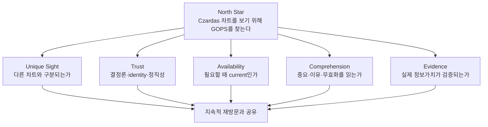
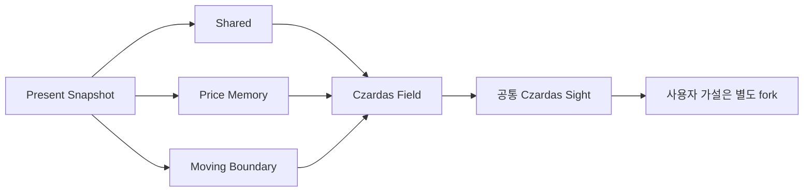
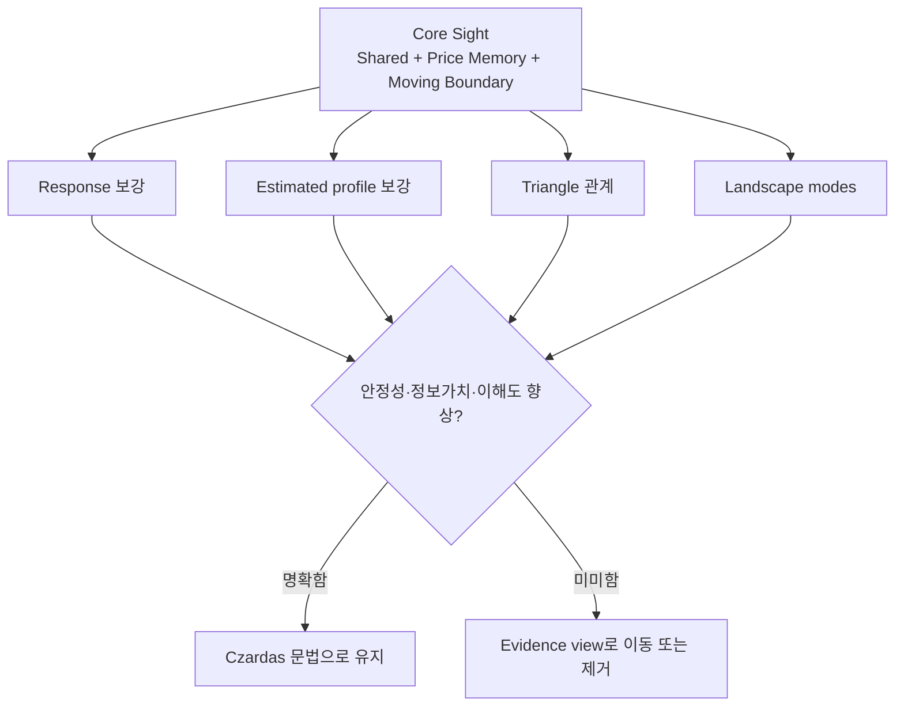
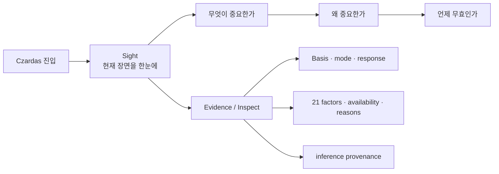
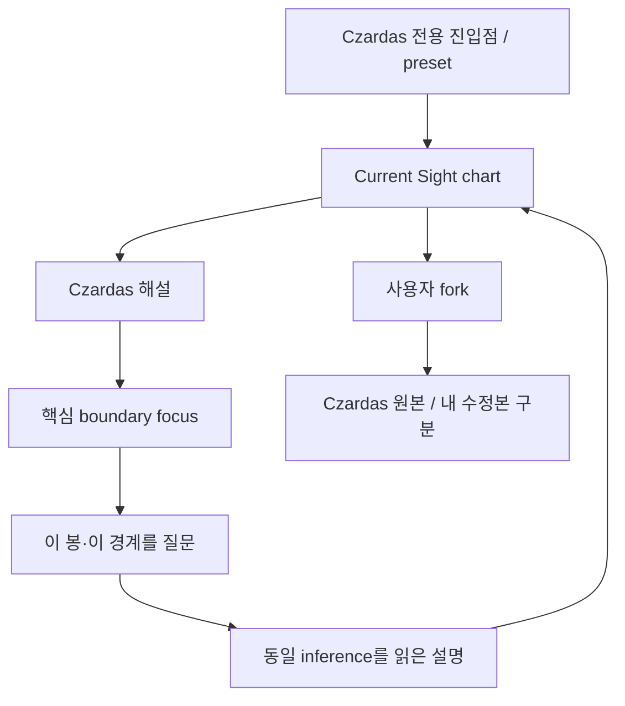
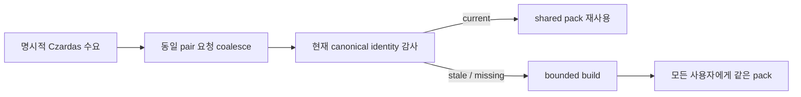
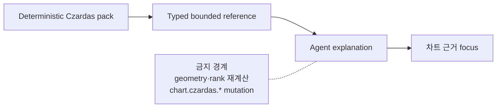
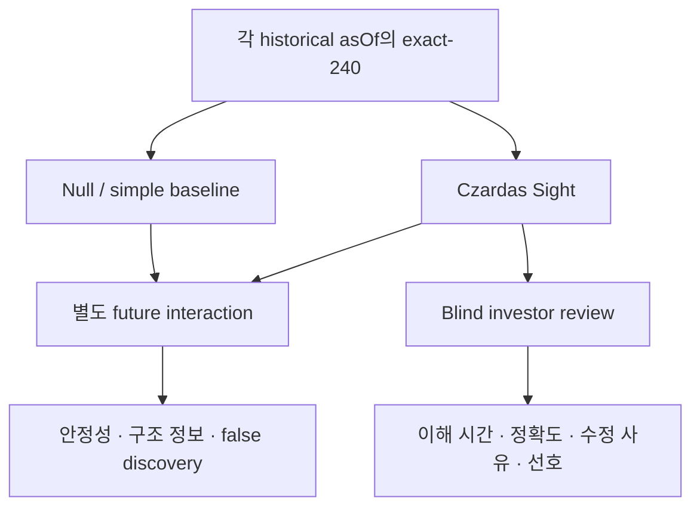
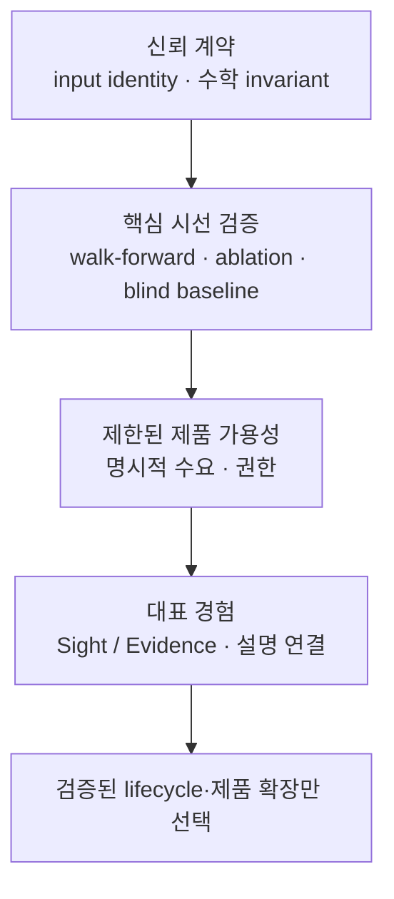

# Codex를 위한 Czardas 발전 제안서

> 현재 Czardas v2를 구현한 Codex가 다음 변경을 판단할 때 참고할 비전·기술 제안서

이 문서는 파일별 작업 목록이나 확정된 구현 계획이 아니다. 모든 항목을 그대로 구현하라는 뜻도 아니다. Codex는 현재 코드와 기준 문서를 다시 읽고, 각 제안이 **Czardas의 고유한 시선과 제품 성공 조건을 강화하는지** 판단한 뒤 가장 작고 일관된 변경 묶음을 제안해야 한다.

상세 분석 근거는 [Czardas 분석 보고서](./CZARDAS_ANALYSIS_REPORT.md)를 따른다.

---

## 1. Codex에게 요청하는 핵심 판단

다음 목표를 중심으로 현재 Czardas를 발전시켜 달라.

> **투자자가 Czardas 차트를 보기 위해 GOPS를 찾게 한다.**

이 목표는 detector 수, drawing 수, factor 수 또는 LLM 설명 길이로 달성되지 않는다. 다음 조건이 함께 충족되어야 한다.

1. 다른 차트와 구분되는 Czardas만의 시선이 첫 화면에서 보인다.
2. 그 시선은 같은 입력에서 항상 같고, 다른 의미 입력이면 identity가 달라진다.
3. 사용자가 찾는 symbol과 interval에서 충분히 최신인 Czardas가 준비되어 있다.
4. 사용자는 무엇이 중요한지, 왜 그런지, 언제 무효인지 빠르게 이해한다.
5. rank와 pattern이 예측 확률이나 매매 신호처럼 보이지 않는다.
6. 실제 사용자와 point-in-time 연구를 통해 시선의 정보가치가 검증된다.



새 기능이 이 다섯 축 중 아무것도 개선하지 않는다면, 얼핏 유용해 보여도 Czardas 기본 surface에 넣지 않는 편이 낫다.

---

## 2. 먼저 보존할 Czardas의 헌법

Codex는 변경 전에 다음을 Czardas의 개념적 sight constitution에 해당하는 불변 원칙으로 취급할지 판단해 달라. 이는 특정 코드 타입을 만들라는 지시가 아니다.

### 2.1 보존 가치가 높은 원칙

1. **Present Snapshot**  
   Czardas는 과거 signal replay가 아니라 exact-240 전체를 본 현재 장면이다.

2. **세 시선**  
   Shared는 봉의 두드러짐, H-Line은 가격 기억, Trend는 움직이는 경계다.

3. **Field first, drawing second**  
   선택된 선이 없어도 CandleMeaning을 가진 no-draw Field는 유효하다.

4. **Deterministic geometry**  
   LLM, 뉴스, 재무, 사용자 취향이 geometry와 rank를 바꾸지 않는다.

5. **Honest abstention**  
   근거가 없으면 선을 만들지 않고, stale/incompatible Field를 current Sight처럼 보이지 않게 한다. stale drawing overlay를 유지한다면 상태를 별도로 드러낸다.

6. **Shared official sight**  
   모든 사용자에게 같은 pack을 주고, 개인 편집은 별도 fork로 분리한다.

7. **Closed provenance**  
   inference → mode → candidate → drawing과 선택 근거를 역추적할 수 있어야 한다.

8. **No hidden fallback**  
   이전 engine이나 generic geometry를 Czardas처럼 보여 주지 않는다.



### 2.2 재검토할 수 있는 구현 선택

다음은 Czardas의 본질이라기보다 현재 구현의 선택이다. 데이터와 사용자 검증에 따라 바꿀 수 있다.

- response bonus의 정확한 식과 최대값
- estimated profile의 rank bonus와 기본 화면 노출
- Triangle 명칭과 badge의 기본 노출
- 21개 factor의 가중치·정규화·표시 방식
- mode와 response landscape의 생성 폭
- display count와 rank threshold
- 240이라는 bar 수를 모든 interval에 동일 적용할 때의 설명 방식
- 실측 약 76 KiB인 Field와 80 KiB 상한, 96 KiB pack 상한의 transport 형태

### 2.3 기본 surface에 넣지 말아야 할 방향

- MA, RSI, MACD 등 일반 indicator를 추가해 정답 투표를 만드는 것
- 전통 chart pattern을 계속 늘리는 것
- symbol별 threshold와 사례별 예외 branch
- LLM이 좌표, geometry, rank 또는 Czardas explanation fact를 발명하는 것
- heuristic rank를 상승 확률·신뢰 확률로 표시하는 것
- 사용자별로 공통 Czardas pack을 다르게 계산하는 것
- 전 universe와 전 interval을 무차별 자동 계산하는 것

---

## 3. 제안 A: 수학적 신뢰 계약을 확장보다 먼저 복구

현재 가장 먼저 판단할 문제는 새 detector가 아니라 **동일 inference가 동일한 의미를 보장하는가**다.

### 제안 취지

입력 identity, robust normalization, ridge topology, integrity coverage와 Trend episode 좌표를 명시적 수학 불변조건으로 다시 정의해 달라. 구현 방법은 Codex가 현재 canonical candle precision, 저장 contract와 성능을 확인한 뒤 선택한다.

### 반드시 감사할 항목

| 항목 | 현재 관찰 | Codex가 결정할 불변조건 |
| --- | --- | --- |
| float input digest | 8자리 반올림 digest와 full-float 계산이 다름 | 의미 계산에 쓰인 값과 hash 입력이 동일해야 함 |
| config identity | `configVersion`만 inference ID에 포함 | 실제 계산 config 변경은 identity 또는 강제 version gate에 반영 |
| canonical flags | public kernel이 누락 값을 기본 계약으로 수용 | canonical provenance를 kernel에서 강제할지 boundary에서 봉인할지 명시 |
| MAD=0 | `1e-12` floor가 미세 noise를 개별 factor 극값으로 포화시킬 수 있음 | tick·measurement-aware degenerate policy 정의 |
| disconnected ridge | 분리된 가격 섬이 서로 local neighbor처럼 경쟁 | ridge locality가 가격축 연결성을 보존해야 함 |
| integrity cap | per-bar 0.15 cap 뒤 질량 재정규화 없음 | robustness와 evidence coverage를 분리 |
| Trend episode anchor | contribution price와 episode start time이 결합될 수 있음 | 모든 price-time pair가 같은 source Basis를 가리켜야 함 |
| selection | eligible 후보가 충분하면 목표 수를 거의 채움 | 추가 선이 실제 marginal information을 가질 때만 선택 |

입력 digest 결함은 실제로 다음과 같이 재현됐다.

```text
한 high 값에 +4e-9
-> inputDigest 동일
-> inferenceId 동일
-> basisCount 0에서 2로 변경
-> contentDigest 변경
```

이 항목은 provenance를 장식이 아니라 계약으로 만들기 위한 선행 판단이다.

### 비전 보호장치

- 수치 결함 수정 과정에서 새 indicator나 예외 로직을 추가하지 않는다.
- 특정 corpus의 선 좌표를 oracle로 고정하지 않는다.
- canonical quantization을 도입한다면 계산과 hash가 같은 값 공간을 사용하게 한다.
- 보수적 변화로 선 수가 줄어드는 것은 실패가 아니다.

---

## 4. 제안 B: 복잡한 엔진을 단순한 시선으로 다시 압축

현재 Czardas의 32개 config field에는 version·payload·표시 cap도 포함되지만, 그중 다수의 수학 threshold·weight와 코드 내 상수가 넓은 calibration surface를 이룬다. symbol별 예외는 없지만, 검증 없이 유지하면 overfitting·calibration 위험이 있다.

### 제안 취지

각 보강 로직을 유지하는 이유를 “선이 더 좋아 보인다”가 아니라 다음 세 기준으로 입증해 달라.

1. snapshot이 한 봉 이동할 때 sight가 더 안정적인가?
2. historical `asOf`에서 geometry를 동결한 뒤의 실제 future interaction에 구조적 정보가 더 있는가?
3. 전문 투자자가 더 빨리 정확히 이해하며, 편집한다면 그 이유가 무엇인가?

response, estimated profile, Triangle, non-selected modes, representative hypotheses를 각각 제거하거나 약화한 ablation을 비교할 수 있다. 가치가 약한 보강 요소는 계산과 기본 화면에서 줄이는 편이 Czardas답다.



### mode 폭발을 중요한 신호로 볼 것

현재 6개 real daily fixture 모두 profile이 payload projection에서 빠졌고, 종목별로 수십 개 H-Line/Trend mode와 100개 안팎 response segment가 생략됐다. 이는 단지 80 KiB가 작다는 뜻이 아니다.

- 서로 거의 같은 hypothesis가 너무 많이 생기는가?
- landscape가 Czardas의 시선을 설명하는가, 내부 탐색 과정을 그대로 노출하는가?
- 선택 전 후보 공간을 더 Czardas-native하게 압축할 수 있는가?
- candidate generation과 visual landscape가 같은 cap을 공유해야 하는가?

payload 상한을 올리는 것보다 이 질문에 먼저 답해 달라.

---

## 5. 제안 C: 기본 화면을 Sight, 상세 화면을 Evidence로 분리

현재 default Czardas Field는 전봉 meaning, response density, payload에 보존된 profile, modes, ribbon, hypotheses, Basis, validation, managed drawing과 Triangle을 동시에 그리도록 설계됐다. hover도 21개 raw/normalized factor와 모든 reason을 접기·스크롤 없이 보여 주며 작은 패널에서 5px까지 축소된다.

### 제안 취지

사용자가 처음 보는 화면과 엔진을 감사하는 화면을 구분해 달라.



### Sight에 남길 후보

- 240봉 전체의 Shared candle salience
- 240봉 전체의 H-Line capsule과 Trend diamond/chevron
- 현재 선택된 H-Line과 Trend
- 선택 구조의 명확한 zone 또는 ribbon
- 현재 장면의 한 문장 요약
- 핵심 반증과 무효화 조건
- 실제 관계가 있을 때 하나의 Triangle

### Evidence로 이동할 후보

- non-selected modes
- full response landscape
- estimated profile
- representative hypotheses
- 전체 Basis와 validation glyph
- raw/normalized 21-factor dump

### 용어 제안

- `상대 의미도`는 `최근 240봉 내 의미 백분위`임을 드러낸다.
- `강도`는 persistence·response·profile bonus까지 포함한다는 점을 반영해 `구조 우선순위`, `선택 순위` 또는 더 정직한 이름을 검토한다.
- `formed`와 `response_supported`는 투자자 언어로 구분한다.
- `예측 확률·매매 점수 아님`을 짧고 지속적으로 전달한다.
- `Shared`, `H-Line`, `Trend`, `R2/R5/R13`에는 한 문장 glossary를 제공한다.

### 비전 보호장치

Evidence를 숨기거나 삭제하라는 뜻이 아니다. 첫 화면에서 시각적 위계를 만들고, 사용자가 원할 때 같은 inference에서 pack에 보존된 selected derivation closure와 retained evidence를 볼 수 있게 하라는 제안이다. budget에서 이미 생략된 optional mode·profile·segment까지 복원하는 full audit artifact는 별도 저장 계약의 비용과 효용을 검증한 뒤에만 판단해야 한다.

---

## 6. 제안 D: Czardas를 발견 가능한 하나의 제품 여정으로 만들기

현재 사용자는 일반 chart type select에서 Czardas를 찾아야 하고, 자산이 없으면 `작도 자산(개발)` 패널에서 수동 build해야 한다. 별도 해설 패널은 `차트 해설`이라는 generic 이름을 사용한다.

### 제안 취지

Czardas chart, 설명, 질문과 편집을 하나의 명시적 제품 경험으로 묶어 달라.



Codex가 검토할 제품 질문은 다음과 같다.

- Czardas를 독립 preset 또는 대표 chart entry로 둘 것인가?
- 일반 candle chart의 managed lines와 full Czardas Sight를 어떻게 이름으로 구분할 것인가?
- `차트 해설`을 Czardas의 공식 설명 surface로 승격할 것인가?
- 자산이 missing/stale일 때 사용자가 개발 운영 도구를 보지 않고 어떤 경험을 해야 하는가?
- fork 후 공식 sight와 개인 가설을 어떻게 구별할 것인가?
- latest-only core asset과 섞지 않는 `asOf` 고정 immutable export/image로 snapshot을 공유할 가치가 있는가?
- 핵심 Sight가 검증된 뒤 1D와 1W를 동일 문법으로 나란히 보는 `Czardas Lens`가 적합한가?

여러 indicator를 한 차트에 중첩하는 것보다 여러 interval에서 같은 Czardas 시선을 병렬로 보여 주는 확장이 비전에 더 가깝다.

---

## 7. 제안 E: 수요 기반 freshness를 플래그십 계약으로 검토

exact-240 pack은 새 canonical 완료봉이나 correction으로 input identity가 바뀌면 stale가 된다. 수동 build만으로는 활발한 intraday pair에서 current 상태가 매우 짧다.

### 제안 취지

전 universe Cron을 되살리지 않으면서, 실제로 Czardas를 보는 symbol×interval의 current 비율을 높이는 lifecycle을 설계해 달라.

첫 판단에서 다룰 수요 신호의 후보는 다음과 같다.

- 사용자가 명시적으로 Czardas chart를 연 pair
- 현재 active Czardas chart
- 사용자가 요청한 단일 pair rebuild

watchlist, 반복 조회 pair, 인기 snapshot은 명시적 Czardas 수요와 비용 telemetry가 쌓인 뒤 확장 후보로만 검토한다.



### Codex가 판단할 계약

- interval별 허용 freshness와 time-to-current는 무엇인가?
- chart open이 직접 build를 일으킬지, 명시적 사용자 동의가 필요한지?
- 동일 pair의 동시 요청을 어떻게 하나로 합칠지?
- stale drawing과 stale Field를 각각 어떻게 취급할지?
- repair credential이 없는 환경에서 어떤 고객 메시지를 줄지?
- current pack이 없는 상태를 제품 실패와 정상 abstention 중 무엇으로 분류할지?

### 비전 보호장치

- fake candle을 만들지 않는다.
- repair provider 응답을 canonical reread 없이 inference에 넣지 않는다.
- 전 종목·전 interval broad preload를 기본값으로 만들지 않는다.
- 자동화를 이유로 stale 또는 partial pack을 current처럼 제공하지 않는다.

---

## 8. 제안 F: Czardas-aware 설명을 추가하되 LLM 경계는 유지

현재 일반 Agent는 선택된 candle을 `chart.candle`로 받을 뿐 Czardas meaning, boundary, inference provenance를 구조적으로 받지 못한다.

### 제안 취지

범용 Agent가 Czardas를 재계산하거나 수정하지 않고, 완성된 pack의 bounded fact를 읽어 설명할 수 있는 typed reference 또는 read-only snapshot을 검토해 달라.

Codex는 구체 타입과 namespace를 먼저 고정하기보다, 다음 의미 단위를 bounded reference로 분리할 가치가 있는지 판단해 달라.

- 선택 candle의 Czardas meaning
- 선택 H-Line 또는 Trend boundary
- Triangle 같은 순수 geometry relation
- 공식 drawing과 사용자 fork의 ownership 차이

필요한 provenance의 최소 범위도 Codex가 contract 비용과 privacy·payload를 보고 결정해야 한다. 후보는 다음과 같다.

- symbol, interval, timestamp
- inferenceId, asOf, inputDigest
- Shared/H-Line/Trend summary와 role
- 선택 객체와 직접 관련된 factor/reason subset
- sourceCandidateId, sourceFieldModeId, derivation digest
- invalidation과 data qualifier



내부 `chart.czardas.*` command가 system actor 전용인 현재 경계는 유지해야 한다. Agent의 역할은 같은 inference를 투자자 언어로 번역하고, 반증·무효화를 설명하며, 기존 근거를 focus하는 데 한정한다.

---

## 9. 제안 G: 투자적 유효성을 Czardas다운 방식으로 평가

현재 테스트는 결정론, contract, invariance, payload와 성능에 강하지만 “이 시선이 의미 있는가”를 측정하지 않는다.

### 연구 평가 제안

1. **Point-in-time walk-forward**  
   각 과거 `asOf`에서 exact-240을 새로 계산하고 이후 구간을 별도로 평가한다.

2. **Snapshot stability**  
   한 봉 이동, interior correction, split, volatility regime 변화에서 role별 geometry를 matching하고 ATR-normalized endpoint·slope·zone drift와 Field churn을 측정한다. candidate ID 생존은 구조 품질이 아니라 provenance UX 지표로 분리한다.

3. **Null 및 단순 baseline**  
   volatility clustering과 gap을 보존하는 moving/block bootstrap, regime-matched surrogate, 단순 pivot line, 고정 support/resistance와 비교한다. 단순 shuffle은 구조를 지나치게 파괴하므로 하한 진단에만 쓴다.

4. **Ablation과 sensitivity**  
   volume, response, profile, Triangle, multi-radius, recency를 제거하거나 threshold를 변화시킨다.

5. **Coverage**  
   대형주, 고변동주, ETF, 채권 ETF, 저가주, gap, flat, 여러 interval과 시장 regime을 포함한다.

6. **Human utility**  
   전문 투자자가 구조를 찾는 시간, task 이해 정확도, 무효화 이해도와 blind preference를 측정한다. 선 편집·삭제는 품질 점수로 바로 쓰지 말고 틀림·과밀·개인 가설·what-if 등 이유를 함께 수집한다.



### 평가하지 말아야 할 방식

- 현재 pack의 과거 candle color를 당시 signal로 간주하는 backtest
- 한 종목의 특정 선 좌표를 합격 oracle로 만드는 것
- P&L 하나로 Czardas sight 전체를 최적화하는 것
- 선택 rank를 사후 성공률에 맞춰 곧바로 확률로 이름 바꾸는 것

### 제품 성공 지표 제안

- Czardas chart 진입률과 current asset 비율
- missing/stale 때문에 이탈한 비율
- dwell time, candle meaning focus, layer toggle
- Czardas 해설에서 boundary focus한 비율
- fork/suppress/restore 비율
- Czardas reference를 포함한 Agent 질문율
- snapshot 저장·공유와 7일/30일 재방문
- “의사결정 구조가 더 명확해졌는가” 사용자 평가

North Star는 단기 클릭 수보다 **Czardas를 보기 위한 반복 방문**이어야 한다.

---

## 10. 제안 H: shared asset에 맞는 운영·contract 경계 강화

다음은 Czardas의 수학은 아니지만 제품 신뢰를 위해 Codex가 별도 판단해야 할 주제다.

### Mutation과 job ownership

- 전역 shared asset의 build, force build, delete 권한을 누가 갖는가?
- status와 cancel은 submit owner만 가능한가, 운영자는 예외인가?
- 로그인만으로 mutation을 허용할 것인가?
- rate limit과 idempotency는 어떤 단위로 적용할 것인가?

### Submit과 terminal state

- production의 `progress.initialize()`와 `queue.submit()`이 같은 PostgreSQL enqueue를 두 번 수행하는 경계를 하나로 만들 수 있는가?
- enqueue가 성공한 뒤 두 번째 호출 실패로 API가 503을 반환하는 모순을 막을 수 있는가?
- completed/failed job을 cancel이 덮지 않도록 terminal invariant를 둘 것인가?
- builder raw exception 대신 public reason code를 저장할 것인가?

### Fetch와 payload scale

- chart가 한 interval만 필요한데 symbol의 모든 pack을 받아야 하는가?
- metadata/freshness manifest와 pack detail을 분리할 가치가 있는가?
- ETag 또는 content digest를 transport cache에 사용할 수 있는가?
- stale pack payload를 항상 전송해야 하는가?
- 1W freshness read가 1,300 daily rows를 읽는 비용을 어떻게 관측할 것인가?

### Contract ownership

Python validator, TypeScript validator, JSON schema가 모두 필요한 관계 검증을 어떤 source에서 파생할지 검토할 수 있다. 자동 code generation이 모든 relational invariant를 표현하지 못할 수 있으므로, 단순히 한 validator를 삭제하기보다 다음을 분리하는 편이 좋다.

- 구조 schema
- cross-field provenance invariant
- frontend runtime safety
- storage size/identity invariant

### Inference와 표현 version

현재 kernel compiler가 한국어 claim, drawing style와 line width까지 만든다. LLM으로 옮기지 않으면서도 다음 두 contract를 논리적으로 분리할지 검토해 달라.

```text
Czardas Inference
  facts · geometry · rank · provenance

Czardas Sight Projection
  visual grammar · deterministic explanation · locale
```

이 분리는 표현 실험이 수학 identity를 불필요하게 흔들지 않게 할 수 있다. 반대로 분리 비용이 더 크다면 현재 통합을 유지하되 version 책임을 명확히 해야 한다.

---

## 11. Codex의 판단 우선순위

이 제안서는 구현 순서를 확정하지 않지만, 판단의 선후관계는 다음처럼 보는 것이 타당하다.



새 detector나 지표 확장은 이 네 판단을 앞서지 않는 편이 좋다.

### Codex가 먼저 답해야 할 질문

1. Czardas의 최소 수학 코어는 정확히 무엇인가?
2. response, profile, Triangle 중 기본 Sight에 꼭 필요한 것은 무엇인가?
3. 같은 입력과 같은 inference의 정의를 어떤 precision으로 봉인할 것인가?
4. exact-240을 모든 interval에 유지한다면 실제 calendar span을 어떻게 설명할 것인가?
5. current availability의 제품 SLO는 interval별로 무엇인가?
6. Sight와 Evidence를 구분할 때 첫 장면에 남길 최소 시각 요소는 무엇인가?
7. rank를 투자자가 오독하지 않게 어떤 이름과 문맥으로 표현할 것인가?
8. 일반 Agent가 Czardas를 어디까지 읽고 어디부터 금지되어야 하는가?
9. 어떤 연구·사용자 지표가 좋아져야 새로운 로직을 유지할 것인가?
10. 전역 shared asset mutation을 누가 소유하는가?

---

## 12. 제안의 성공 가설

Codex는 구체적 구현안을 제시할 때 다음 가설이 검증 가능한지 함께 판단해 달라.

### 신뢰

- 의미 결과가 달라지는 모든 입력 변화는 identity에 반영된다.
- 같은 canonical input과 config는 어떤 실행에서도 같은 pack content를 만든다.
- stale, incompatible, partial data가 current sight로 보이지 않는다.

### 시선

- 사용자는 5초 안에 중요한 H-Line과 Trend를 구분할 수 있다.
- 기본 Sight에서 선택 구조가 non-selected landscape보다 명확하다.
- Evidence view를 열면 같은 inference에 보존된 selected closure와 retained evidence를 볼 수 있다.

### 투자적 정직성

- 사용자는 percentile과 rank를 상승 확률로 오해하지 않는다.
- 왜 유효한지와 언제 무효인지가 함께 보인다.
- 과거 candle meaning이 current reinterpretation임을 이해한다.

### 제품

- 실제 Czardas 진입의 대부분이 current pack을 받는다.
- 사용자는 개발 asset 패널을 몰라도 Czardas를 사용할 수 있다.
- 차트, 해설, Agent 설명이 같은 inference ID를 가리킨다.
- Czardas 사용자의 반복 방문과 snapshot 공유가 증가한다.

### 성능·운영

- synthetic뿐 아니라 mode-heavy real corpus에서도 latency와 payload gate를 만족한다.
- 동일 pair build가 coalesce되고 terminal state가 일관된다.
- 권한 없는 사용자가 shared asset을 mutate하거나 다른 job을 cancel하지 못한다.

---

## 13. 작업 범위와 주의사항

Codex가 이 제안서를 바탕으로 실제 변경을 제안하거나 구현할 때 다음 repository 규칙을 지켜야 한다.

- 먼저 `docs/README.md`와 관련 agent/Czardas 기준 문서를 읽는다.
- current code와 기준 문서가 충돌하면 충돌을 먼저 보고한다.
- structure-only 작업에서 API, order, chart, KIS, Kafka, DB behavior를 바꾸지 않는다.
- fake market candle을 만들지 않는다.
- root `.venv`와 Python 3.12를 사용한다.
- 계약이 바뀌면 Czardas, backend, frontend, architecture, AWS 문서를 같은 변경에서 정합화한다.
- push, AWS 배포, migration 적용은 사용자 요청 없이 수행하지 않는다.
- 기존 working tree의 사용자 변경을 덮어쓰지 않는다.

현재 문서상 확인된 충돌도 먼저 정리해야 한다.

- `docs/czardas/README.md`의 “AWS 배포 없음” 표현과 실제 K8s/AWS assets
- 미구현 generic Chart Intelligence 설계와 현재 독립 Czardas runtime의 관계
- PresentSnapshot의 current reinterpretation과 과거 signal look-ahead 금지의 의미 경계

---

## 14. 최종 요청

Codex는 Czardas를 더 많은 분석 기능의 컨테이너로 만들지 말아 달라. 먼저 다음 세 가지를 선명하게 해 달라.

```text
1. Czardas는 정확히 무엇을 보는가?
2. 그 시선은 왜 믿을 수 있는가?
3. 투자자는 왜 다시 이 차트를 보러 오는가?
```

제안이나 변경이 이 질문에 답하지 못하면 보류하는 편이 맞다. 반대로 수학을 단순하게 만들고, Field를 더 읽기 쉽게 하며, current Czardas를 안정적으로 제공하고, 같은 inference를 차트·해설·대화가 공유하게 한다면 적극적으로 검토할 가치가 있다.

**Czardas의 성공은 더 많은 정답을 내는 것이 아니라, 시장을 보는 하나의 강한 눈을 제품으로 완성하는 데 있다.**

---

## 부록: 판단할 코드 경계

이 목록은 작업 지시가 아니라 현재 책임 경계를 다시 확인하기 위한 참고다.

- 수학·identity: `systems/market-data/shared/alfaka/analytics/czardas/`
- canonical input: `systems/market-data/shared/alfaka/analytics/czardas/data.py`, `alfaka/candles/`
- asset build·queue·storage: `systems/agent-orchestration/shared/gops_agents/czardas_assets/`
- API: `systems/api-server/pods/api-server/gops-backend/app/routes/czardas_assets.py`
- shared contract: `shared/chart-contract/chart-czardas-pack.schema.json`
- frontend validation/cache: `apps/gops-frontend/src/chart/czardasAssetsApi.ts`
- Field decoding: `apps/gops-frontend/src/chart/czardasMeaning.ts`
- rendering: `apps/gops-frontend/src/chart/ChartCanvas.tsx`
- product surface: `apps/gops-frontend/src/components/ChartPanel.tsx`, `ChartCommentaryPanel.tsx`, `ChartAssetOpsPanel.tsx`
- managed edit semantics: `apps/chart-engine/src/commands.ts`, `types.ts`
- current tests: `systems/market-data/tests/analytics/czardas/`, `systems/agent-orchestration/tests/test_czardas_*`, `apps/gops-frontend/tests/czardas*`
