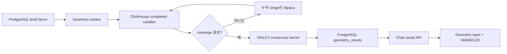

# Chart Geometry Assets

Chart Geometry Asset은 완료된 실제 OHLCV 봉에서 현재 지지·저항과 삼각형만 계산해
차트에 적용하는 결정론적 자산이다. LLM 해설이나 다른 패턴을 생성하지 않는다.

이 문서는 동결한 코드 기준점 `16e0fa5`에서 롤백 경로로 보존한 Geometry 계약을 설명한다.
현재 기본 분석 엔진은 수동 빌드 방식의 Czardas v1이며, 그 구현 계약은
[czardas/README.md](czardas/README.md), [czardas/ENGINE_SPEC.md](czardas/ENGINE_SPEC.md),
[czardas/IMPLEMENTATION_PLAN.md](czardas/IMPLEMENTATION_PLAN.md)가 함께 정의한다. API에서
`assetKind`를 생략하면 아래 Geometry 동작과 byte/behavior compatibility를 유지한다.

## 지원 범위

- interval: `1m`, `5m`, `10m`, `1h`, `4h`, `1D`, `1W`
- geometry: 지지선 최대 2개, 저항선 최대 2개, 최고 삼각형 1개(선 2개)
- 삼각형: 상승, 하락, 대칭
- 보조지표: 선택 interval의 완료 봉 개수 기준 SMA60·SMA120과 최근 교차
- 좌표: 해당 interval에 실제로 존재하는 canonical candle timestamp와 가격
- intraday: `1m` 실제 정규장 봉, `5m/10m/1h/4h`는 09:30 ET 기준 파생 봉

삼각형은 방향전환 피벗의 최근 연속 묶음을 회귀선으로 적합한 뒤 상승·하락·대칭
형태를 판정한다. 경계마다 최소 2회, 전체 최소 5회 접촉과 수렴·내부 포함 조건을
통과한 형성 중 또는 돌파 확인 후보 중 최고 점수 1개만 표시한다. 지지·저항은 별도의
OHLCV 접촉 증거 계산을 계속 사용한다.

## 데이터와 저장 흐름

차트 자산 하위 시스템은 S3, Redis, Kafka, LLM을 사용하지 않는다. 파생 intraday가
부족하면 Alpaca `1Min` 원본을 ClickHouse에 보충하고 같은 공통 집계기로 상위 봉을
저장한 뒤 재조회한다. 다른 GOPS 하위
시스템의 해당 인프라 사용에는 영향을 주지 않는다. `1W`는 기존처럼 ClickHouse의
canonical `1D`를 집계하며 Alpaca native 주봉을 저장하지 않는다.

목표 완료 봉은 인트라데이와 `1D`가 380개, `1W`가 312개다. 최신까지 연속된 완료
봉이 120개 이상이고 과거 head만 부족하면 partial 자산을 허용한다. 중간이나 최신
결측은 보충 후에도 남으면 실패하며 기존 성공 자산을 교체하지 않는다. 단, 성공한
Alpaca 요청에도 실재 봉이 없는 무거래 slot은 `provider_confirmed_empty`로 인정하며
가짜 봉을 만들지 않는다.

## 실행

- API 패널에서 symbol/interval을 선택해 PostgreSQL 작업을 등록한다.
- 평일 KST 08:40 CronJob이 S&P500 전체 7개 interval 작업을 멱등 등록한다.
- 수동 실행은 `scripts/aws/run-chart-geometry-build-job.sh`를 사용한다.
- 빌드 상태는 PostgreSQL polling으로 확인한다.

새 완료 봉 때문에 stale이 된 자산은 차트에서 제거하지 않고 낮은 불투명도로 표시한다.
현재 symbol과 interval이 모두 일치하는 자산만 적용한다.

## 현재 Czardas v1 확장

- 수동 패널 action은 정확히 한 `symbol × interval`의 최신 완료봉 240개를 감사·보충·분석한다.
- 결과는 PostgreSQL `chart_assets.czardas_latest`에 저장하고 작업은 별도
  `czardas_build_jobs/items`에서 `cza-` ID로 처리한다.
- `assetKind=czardas` GET은 저장된 공통 pack과 `current/stale/missing/incompatible`
  freshness만 읽는다. GET 자체는 repair, kernel, enqueue, PostgreSQL write를 하지 않는다.
- Czardas는 H-Line `0..4`, Trend `0..3`과 선택된 두 Trend의 파생 Triangle만 제안한다.
  기본 목표는 H-Line 2개, Trend 2개이며 근거가 부족하면 no-draw Field를 반환한다.
- 프런트 기본 release constant는 `czardas`다. H-Line/Trend layer는 독립 toggle이고,
  managed drawing 편집·삭제는 session-only fork/suppression이다. Geometry DB와 worker는
  제거하지 않는다.
