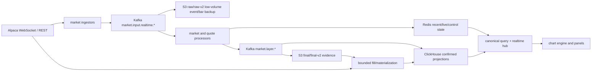

# Chart Data Architecture

This is the current source of truth for chart data from Alpaca ingress to
frontend rendering. Platform-specific keys, tables, topics, and prefixes live
in `platform/{kafka,redis,clickhouse,s3}/README.md`.

## Invariants

- A data-internal refactor must preserve visible geometry unless the task explicitly
  changes the canonical candle contract. The regular-session intraday migration is
  such an explicit change: derived US-equity candles are anchored at 09:30 ET.
- Frontend code reads REST/WebSocket contracts only. It never reads Redis,
  ClickHouse, or S3 directly.
- Historical candles are canonical only when `priceAdjustment=split` and
  `canonicalVersion=v2`.
- Raw S3 keeps low-volume event/bar backup evidence only; realtime trades/quotes
  are excluded and raw S3 is never chart serving or ClickHouse materialization input.
- Local runtime never injects fake market candles. `?orderFlowDemo=1` is a
  browser fixture path only.
- US-equity `1m` is the real provider source. `5m/10m/1h/4h` are materialized
  from regular-session `1m` with `bucket_policy=us_equity_regular_session`.
  Bucket timestamps are stored in UTC, while session open/close and early-close
  decisions use the NYSE calendar in `America/New_York`.
- Orders, KIS, and agent APIs are outside this data-plane contract.

## Runtime Flow



`key=symbol` preserves per-symbol Kafka order. Live provisional candles and
quote/trade markers use Redis plus the global `market.events` pub/sub channel;
there is no live-candle Kafka topic.

ClickHouse tick persistence is at-least-once at the Kafka boundary and
idempotent at the sink boundary. The loader keeps Kafka record metadata through
the HTTP insert, supplies a deterministic `insert_deduplication_token` derived
from `topic + partition + offset`, and commits only the offsets represented by
the successful batch. A bounded per-process `sourceEventId` cache filters short
replays even when Kafka returns the records in a different batch. Existing
non-replicated MergeTree tables must enable their insert-deduplication window
with the operator migration.

## Placement Rules

| Data | Compute owner | Runtime store | Durable store | Load curve |
| --- | --- | --- | --- | --- |
| Closed candles | stream processor | Redis newest window | ClickHouse + S3 final | market activity |
| Live candle/trade/quote | stream/quote processor | bounded Redis keys | ticks in ClickHouse | throttled market activity |
| Candle indicators | API request | Redis TTL cache | none | unique requests |
| Candle volume profile | API request | Redis TTL cache | none | unique requests |
| Bid/Ask intraday minutes | stream processor | Redis closed/current minute blobs | trade/quote ticks in ClickHouse | flush interval, not trade count |
| Daily order flow | EOD rollup job | none | `order_flow_profile_daily` | one bounded batch/day |
| Compare | API canonical candle query | short Redis response cache | candle facts only | unique requests |

Persist a derived value only when a named reader needs reuse, recovery, or
audit. Display-only regrouping, such as 1m order-flow minutes into 10m/1h
columns, stays in the frontend bucket cache and does not create a new fact.

## Query Contract

The single candle read boundary is `CanonicalCandleQuery`:

```text
Redis recent/live projection
  -> ClickHouse matching bucket-policy rows or bounded canonical 1m aggregation
  -> optional bounded foreground Alpaca fill for the requested window
  -> background processed S3 final/final-v2 materialization
  -> background Alpaca historical fill
```

S3 objects count as a hit only when `matchedRowCount > 0` for the requested
symbol, interval, and half-open time range. A v2 shard object is materialized
as one audit unit, including shard-collision rows for other symbols; those rows
do not satisfy the request. Multiple objects are deduplicated by
`symbol + interval + timestamp` before one ClickHouse insert, and object audits
are written only after that insert succeeds.

## Public Chart Interfaces

Stable routes include:

```text
GET  /api/charts/candles
GET  /api/charts/compare
GET  /api/charts/volume-profile-bins
GET  /api/charts/indicators
GET  /api/charts/order-flow/symbols
GET  /api/charts/order-flow/daily
GET  /api/charts/order-flow/intraday
POST /api/charts/active-symbol
WS   /ws/charts
```

WebSocket candle events remain `LIVE_CANDLE_UPDATE`, `CANDLE_CLOSED`, and
`CANDLE_CORRECTED`. Order flow adds `ORDER_FLOW_BINS_UPDATE`. Derived responses
finish with `derived.state=ready|failed` and
`derived.source=api-compute|redis`; there is no derived queue, worker, or
ClickHouse artifact contract.

## Order Flow Consumers

- The `bidask` chart type reads intraday minute rows and supports `1m`, `10m`,
  and `1h` display buckets.
- `OrderFlowPanel` reads only today's intraday Redis data and owns its symbol,
  aggregation window, and display resolution independently from chart panels.
- Daily rows are also retained for audit and existing agent chart context.
  They are not the Bid/Ask chart or `OrderFlowPanel` source.
- Side classification is fixed by the order-flow API metadata. Candle volume
  profile remains estimated candle-range allocation and is a separate feature.

The processor restores an unexpired Redis `live-minute` blob on restart so the
current minute can continue accumulating or be promoted to a closed minute.
Longer processor outages are not reconstructed by the intraday API. A future
coverage project must rebuild missing minute profiles from retained ClickHouse
trade/quote ticks and add minute-level `no-trades` versus `not-collected`
metadata; the frontend must not manufacture zero-volume rows in the meantime.

## S3 Durability

Realtime v2 uses 32 symbol shards and deterministic one-minute objects. Buffer
identity includes `(partition path, UTC minute)`, exact replay performs `HEAD`
and skips an existing digest key, and Kafka offsets commit only after every S3
side effect succeeds. Historical v1 manifests remain readable during dual
layout migration. See `platform/s3/README.md` for exact prefixes.

## Bounded State

- Redis recent candles: 120 rows per symbol/interval.
- Redis live keys and order-flow minute blobs: explicit TTLs.
- Derived cache and locks: versioned keys with short TTLs and atomic Lua owner checks.
- ClickHouse trade/quote ticks: 21-day TTL.
- ClickHouse tick insert tokens: newest 100,000 inserted blocks per table.
- ClickHouse loader recent source IDs: newest 100,000 table/event pairs per pod.
- S3 raw/raw-v2 low-volume backups: operator-owned lifecycle; final evidence has no expiry.
- Processor maps, frontend inactive candle caches, and order-flow bucket caches
  have tested upper bounds.

Czardas assets are a manual build projection, not an API request-derived cache.
The independent builder reads canonical ClickHouse candles
for the requested interval. Missing derived intraday ranges fetch Alpaca `1Min`,
write real regular-session `1m`, materialize the requested session-aligned
`5m/10m/1h/4h`, and re-read ClickHouse. `1W` continues to derive from canonical
`1D`. This canonical repair path does not use S3, Redis, or Kafka.

Alpaca may legitimately omit an intraday slot with no bar. A successful provider
request with no matching real candle is `provider_empty`, not an OHLCV row.
Missing credentials are `credentials_missing`; network, rate-limit, and server
failures are `provider_failed`; a write that still cannot produce exact-240 after
the canonical re-read is `canonical_reread_incomplete`. No zero-volume or
carry-forward candle is manufactured, and an incomplete window is never inferred
or saved.

The repair runner owns `America/New_York`, the code-owned NYSE calendar,
`adjustment=split`, and `[start,end)` independently of pod environment. Repair
rows use a dedicated canonical repair feed profile. This preserves split/v2
facts on legacy `ReplacingMergeTree` keys while fresh tables also key by
`canonical_version + price_adjustment`; live key upgrades are operator-owned
table-copy migrations.

Completed 1D/1W/1M candles use a shared `candleKey`. Daily chart coordinates use
New York market midnight; weekly/monthly coordinates use their UTC bucket start.
The last real NYSE session close, including early close, determines whether a
higher-timeframe bucket is complete. Serving, analysis, stale checks, and drawing
anchor snapping share this identity rather than comparing raw timestamps.

Czardas is the only automatic drawing asset path. It audits exactly the latest
240 completed expected candles, repairs bounded missing ranges through
Alpaca→ClickHouse, re-reads the canonical snapshot, and stores one deterministic
shared pack per `(symbol, interval)` in PostgreSQL
`chart_assets.czardas_latest`. Queue/status, leases, and progress live in
`czardas_build_jobs/items`. Canonical candles and repair materialization
remain in ClickHouse; asset payloads do not.

Chart open, GET miss, candle events, and schedules never enqueue Czardas work.
Only the authenticated development panel may build or delete one explicit pair.
There is no Redis asset key, Kafka asset topic, S3 asset, automatic TTL, or
cross-engine fallback. The exact Czardas contracts live in `docs/czardas/`.
Each v2 pack evaluates the exact-240 rows as one immutable present snapshot;
post-`asOf`/live rows are excluded, while later rows inside that snapshot may
contribute to the current interpretation of an earlier candle.

PostgreSQL `chart_assets.geometry_*` rows and ClickHouse
`market_data.chart_analysis_assets` may remain in existing environments solely
as dormant historical data. Current runtime and migrations must not read,
write, recreate, update, or use them for rollback. Fresh environments do not
create those tables.

## Retained Compatibility

The generic closed-candle topic, tick-fanout topics, and raw manifest lookup
remain compatibility contracts because external consumers are not yet proven
absent. New runtime code must not add readers to them without documenting the
owner. Removal requires broker consumer-group and repository evidence.

Operational procedures and rollback steps are in
`CHART_DATA_OPERATIONS.md`.
